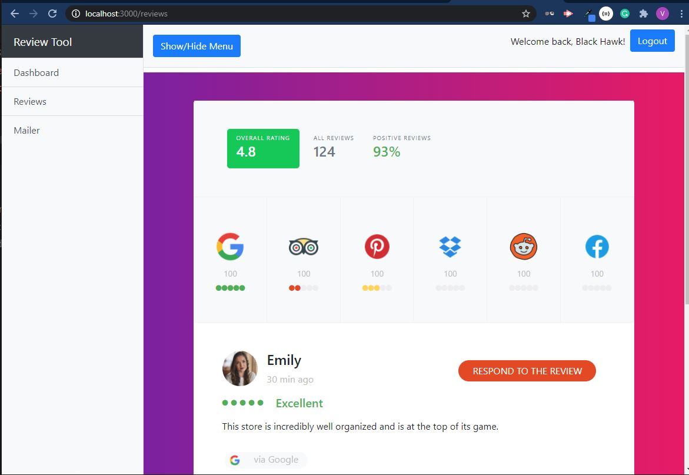
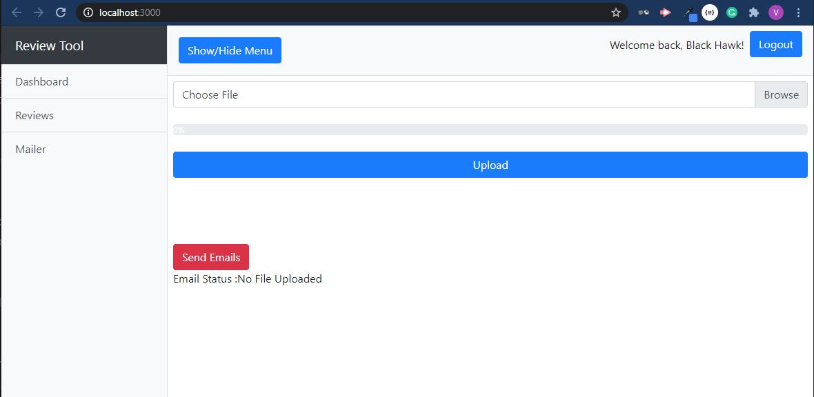

# React File Upload and Send Emails

> 

## Quick Start

```bash
# Install dependencies server/client
npm install in parent directory
cd client
npm install in client directory

create .env file in parent directory with your email and password

USER_EMAIL='your@Gmail'

EMAIL_PASSWORD='yourgmailpassword'

mongoURI='yourmongodbconnectionstring'


# Serve on localhost:3000
npm run dev
```


# Reviews Page

# Mailer Page

